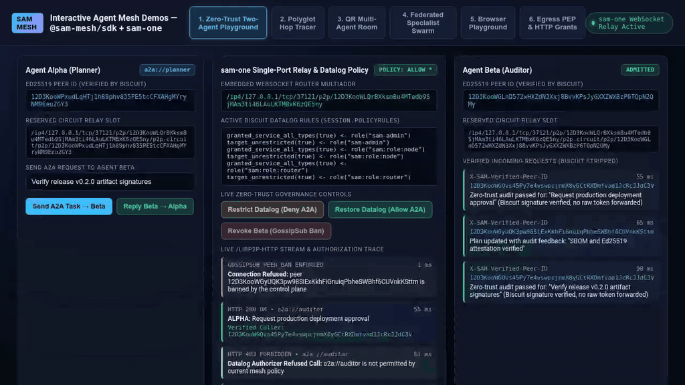
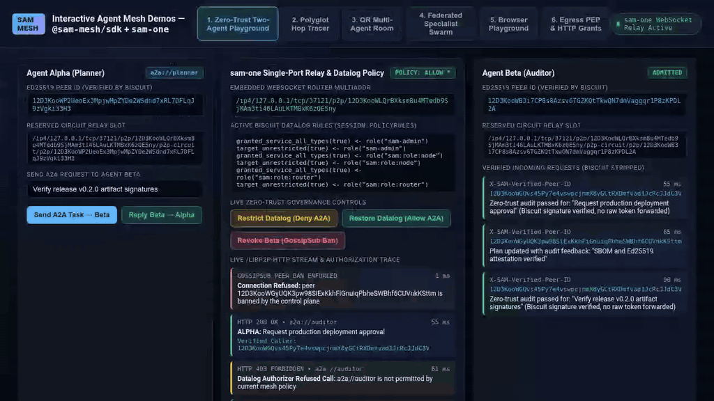
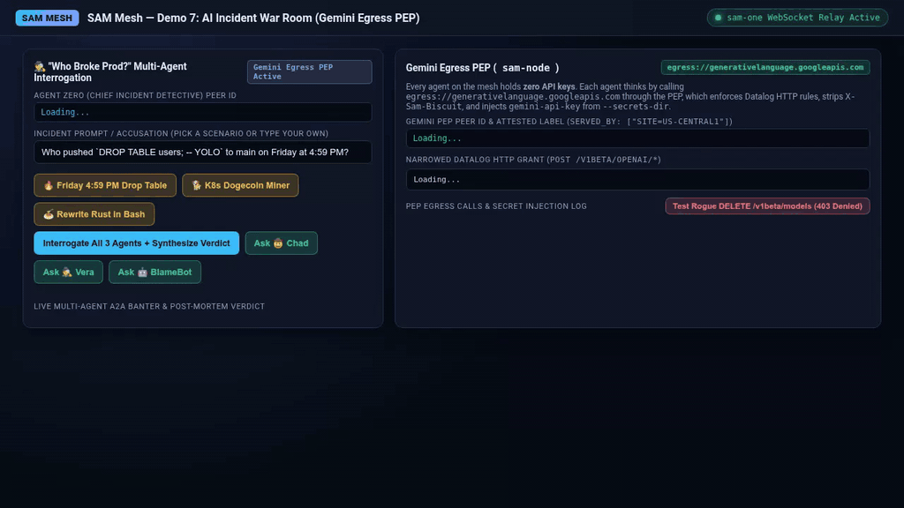

# SAM Agent Mesh Interactive Demos

Demos powered by [`@sam-mesh/sdk`](https://www.npmjs.com/package/@sam-mesh/sdk) and [`sam-one`](https://github.com/google/sam).

## Walkthroughs

### 1. Zero-Trust Two-Agent Playground
Two JS agents exchange authenticated A2A requests over `sam-one`. Policy changes instantly reject traffic, and revoking a peer tears down active streams.

[](./videos/demo-two-agent-playground.mp4)

### 2. Polyglot Hop Tracer
Traces a 2-hop call chain across 3 mesh identities, verifying latency and caller Peer IDs at every boundary.

[](./videos/demo-polyglot-hop-tracer.mp4)

### 3. "Scan-to-Join" Multi-Agent Room
Uses a bounded enrollment token. Four agents collaborate over A2A; a 5th rogue agent is rejected.

[](./videos/demo-qr-multi-agent-room.mp4)

### 4. Federated Specialist Swarm
An orchestrator fans out reviews across 3 specialist agents and aggregates verdicts.

[](./videos/demo-federated-inference-swarm.mp4)

### 5. Zero-Install Browser Playground
Enrolls a browser tab directly into the mesh using WebAssembly Biscuit verification and WebSocket libp2p transport (`?enroll=sam://...` or `?server=...&jwt=...`), serves an in-browser A2A `AgentCard`, discovers `a2a://`, `inference://`, and `egress://` services, consults mesh Gemini (`egress://generativelanguage.googleapis.com` or `inference://gemini`) with zero browser API keys, and banters interactively over `/libp2p-http` with mesh peers. Also runs standalone on [GitHub Pages](https://aojea.github.io/agent-mesh-demos/) against any CORS-enabled control plane.

[](./videos/demo-browser-playground.mp4)

### 6. Egress PEP & HTTP Method/Path Grants
A `contractor` agent with zero upstream secrets calls `egress://api.github.com` through a `sam-node` Egress PEP (`site=eu`). The PEP evaluates `http_method` and `http_path` wire facts against Datalog rules (`methods: ["GET"]`, `paths: ["/repos/acme/*"]`), strips `X-Sam-Biscuit`, and injects the platform vault credential (`--secrets-dir`) only on authorized requests.

[](./videos/demo-egress-pep.mp4)

### 7. "Who Broke Prod?" AI Incident War Room (Gemini Egress PEP + A2A)
An Incident Detective agent interrogates 3 suspect agents (`🤠 Chad`, `🕵️‍♀️ Vera`, and `🤖 BlameBot-9000`) over A2A. Every agent holds **zero API keys** and consults Gemini (`egress://generativelanguage.googleapis.com`) through a `sam-node` Egress PEP (`site=us-central1`) that enforces Datalog HTTP rules (`POST /v1beta/openai/*`), strips `X-Sam-Biscuit`, injects `gemini-api-key` from `--secrets-dir`, and blocks unauthorized methods (`DELETE /v1beta/models/*` &rarr; `403 http_request_denied`). Set `GEMINI_API_KEY` to use live Gemini completions or run zero-config with the built-in persona simulator.

[](./videos/demo-ai-incident-war-room.mp4)

## Quick Start

```bash
SAM_VERSION=v0.1.0-rc.7 ./scripts/setup-sam.sh
npm start
```
Open `http://127.0.0.1:4400`.

## Run Tests
```bash
npm test
```

## Re-Record Videos
```bash
npm run record
```

