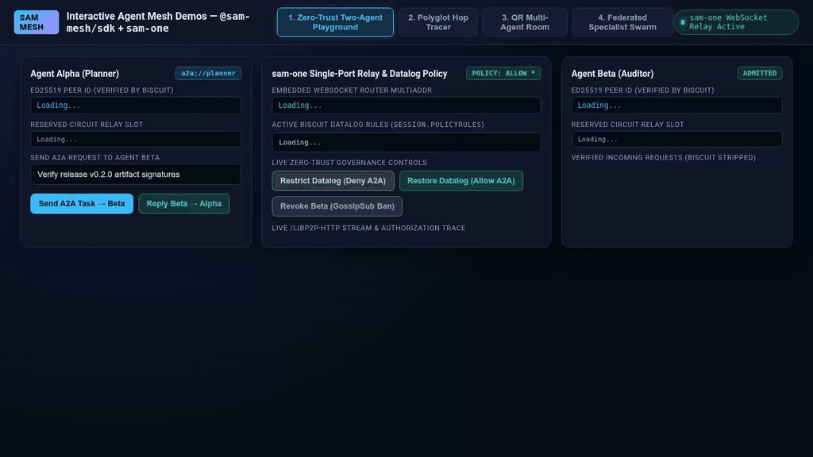
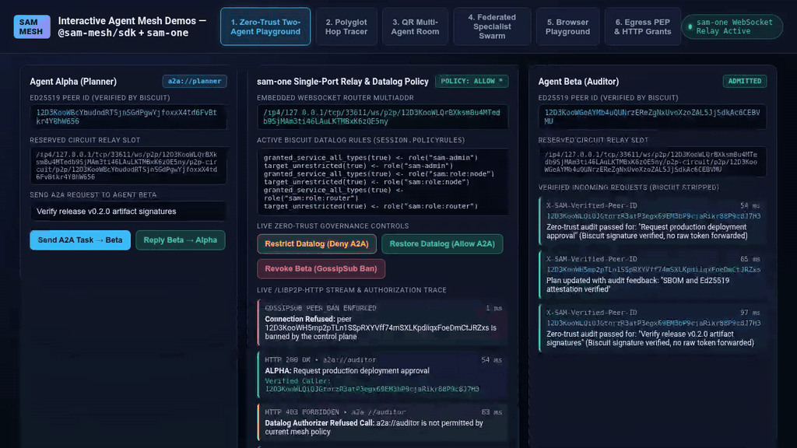
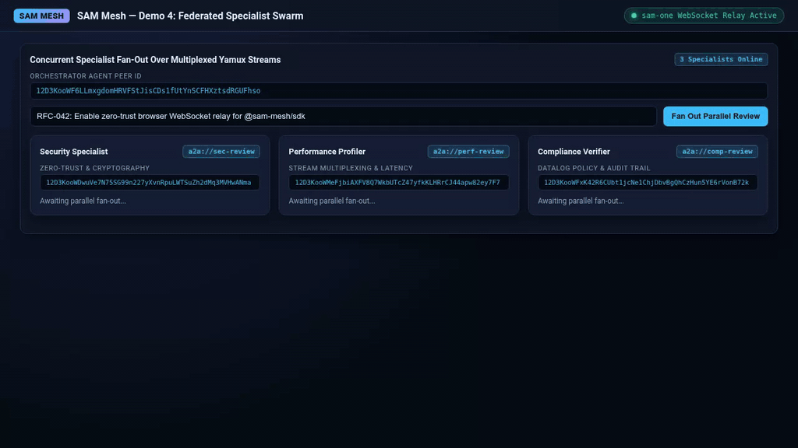

# Agent Mesh (`@sam-mesh/sdk` + `sam-one`) Interactive Demos

Interactive browser and multi-agent mesh demos powered by [`@sam-mesh/sdk`](https://www.npmjs.com/package/@sam-mesh/sdk) and the single-binary [`sam-one`](https://github.com/google/sam) appliance.

---

## Recorded Walkthroughs

### 1. Zero-Trust Two-Agent Playground (`Agent Alpha` ↔ `Agent Beta`)

Two independent JavaScript agents enroll with `sam-one`, reserve Circuit Relay v2 slots, and exchange authenticated A2A requests (`/libp2p-http`). Toggling Datalog policy rules via `POST /policies` immediately rejects unauthorized A2A traffic (`HTTP 403 Forbidden`), and revoking a peer via `POST /user/revoke` propagates a signed `PEER_BAN` event that tears down active streams.

[](./videos/demo-two-agent-playground.mp4)

> [Download / View High-Res MP4 (`videos/demo-two-agent-playground.mp4`)](./videos/demo-two-agent-playground.mp4)

---

### 2. Polyglot "Follow the Packet" Hop Tracer

Traces a 2-hop agent-to-agent-to-tool call chain across 3 distinct mesh identities (`Coordinator` → `Researcher` → `Git Diff Analyzer`), recording per-hop latency and cryptographically verified caller Peer IDs at every boundary (`X-SAM-Biscuit` stripped before reaching the workload handler).

[](./videos/demo-polyglot-hop-tracer.mp4)

> [Download / View High-Res MP4 (`videos/demo-polyglot-hop-tracer.mp4`)](./videos/demo-polyglot-hop-tracer.mp4)

---

### 3. "Scan-to-Join" Multi-Agent Collaboration Room

Mints a single-purpose enrollment token (`max_usages: 4`) rendered as a `sam://enroll?server=...&token=...` URI and QR badge. Four incident-response agents enroll and collaborate over A2A, while a 5th uninvited scraper agent attempting to reuse the exhausted token is rejected by `sam-one`.

[](./videos/demo-qr-multi-agent-room.mp4)

> [Download / View High-Res MP4 (`videos/demo-qr-multi-agent-room.mp4`)](./videos/demo-qr-multi-agent-room.mp4)

---

### 4. Federated Specialist Swarm

An orchestrator agent fans out a parallel architecture review (`Promise.all`) across 3 independent specialist agents (`a2a://sec-review`, `a2a://perf-review`, `a2a://comp-review`) over multiplexed Yamux streams and aggregates their verified verdicts.

[](./videos/demo-federated-inference-swarm.mp4)

> [Download / View High-Res MP4 (`videos/demo-federated-inference-swarm.mp4`)](./videos/demo-federated-inference-swarm.mp4)

---

## Quick Start (Tagged Release)

Fetch a tagged `sam-one` binary from `google/sam` and install the matching `@sam-mesh/sdk` package from npm:

```bash
SAM_VERSION=v0.1.0-rc.5 ./scripts/setup-sam.sh
npm start
```

Open `http://127.0.0.1:4400` in your browser.

## Run Playwright E2E Tests

```bash
npm test
```

## Re-Record Videos

Requires Playwright (`npx playwright install chromium`) and `ffmpeg`:

```bash
npm run record
```
